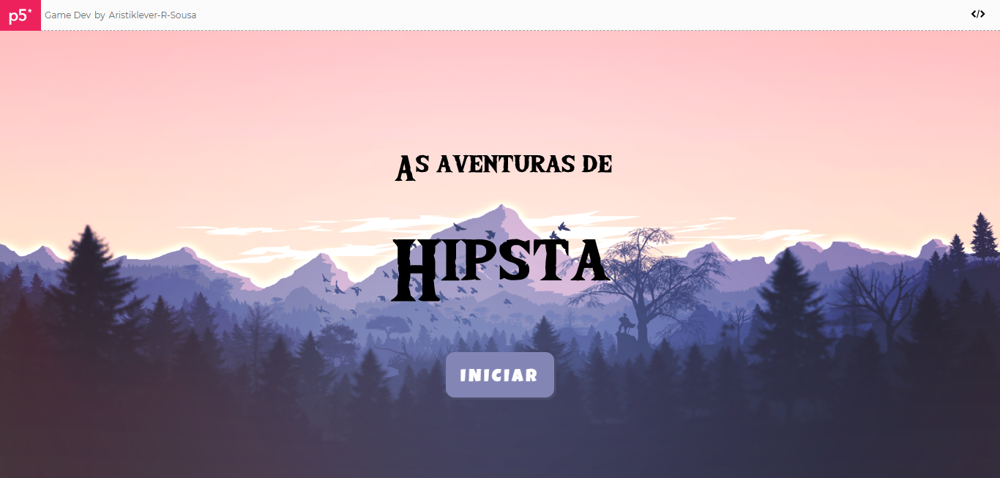
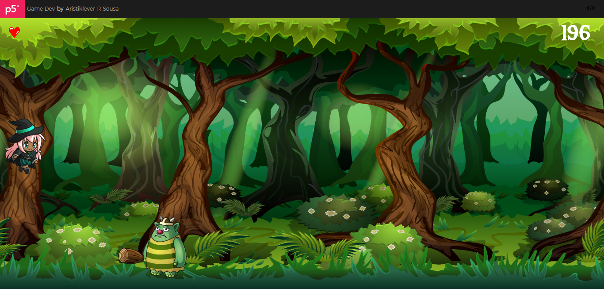

<h1 align="center">Imersão Gamedev JavaScript</h1>



Esse game, denominado de "As aventuras de Hipsta, a bruxinha do bem" foi um projeto desenvolvido durante a semana Imersão Gamedev🕹️ JavaScript, realizada pela Alura!
<br/><br/>

<h2>O que é o P5.js?</h2>
Resumindo, o P5 é uma biblioteca de JavaScript, que serve para trabalhar com aspectos visuais.<br/>
Muito utilizado por programadores para prototipar, para cria games simples, etc.
<br/><br/>

<h2>O que foi ensinado nessa imersão?</h2>
Nessa imersão, proporcinada pela <a href="https://www.alura.com.br/">Alura Cursos</a>, foi ensinado, passo a passo, como criar um game simples em 2D.<br/>
Nesse game, utilizamos concitos de gravidade, de velocidade, posicionamento, etc.
<br/><br/>

<h2>Estrutura básica do P5.js</h2>
Existem duas funçoes básicas:<br/>

```sh
// Setup, onde se carrega aqulio que seá usado durante todo o resto do arquivo (área de inicialização)
setup(){
}

// Pelo próprio nome, é onde se insere os elementos gráficos para o desenho. 
// Essa função possui uma espécie de while(true).
// Ela vai executar tudo que está ali em loop infinito, até que seja dado o comando de noLoop(). 
draw(){
}
```

<h2> 🤔 Como contribuir? </h2>

- Faça um Fork desse repositório;
- Crie uma branch com a sua feature: `git checkout -b my-feature`
- Commit suas mudanças: `git commit -m 'feat: My new feature'`
- Push a sua branch: `git push origin my-feature`

<h2>Informações</h2>
Para mais informações, acesse o <a href="https://p5js.org/">P5.js</a>, lá será explicado tanto sobre a documentação completa,<br/>
quanto sobre como utilizar o próprio editor onlie deles (onde eu produzi o meu).<br/>
<a href="https://editor.p5js.org/Aristiklever-R-Sousa/full/0FWTX7Tmji">Aqui está o link do meu game!</a> (Obd.: Ainda está em fase de desenvolvimento)
<br/><br/>

---

<p align="center">Feito com muito ❤ por mim, Aristiklever Sousa😊.</p>
